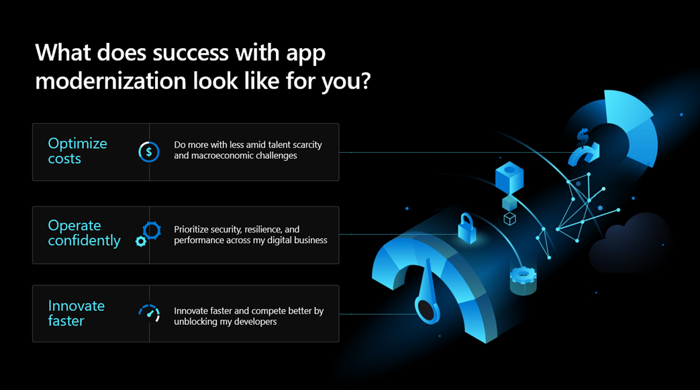
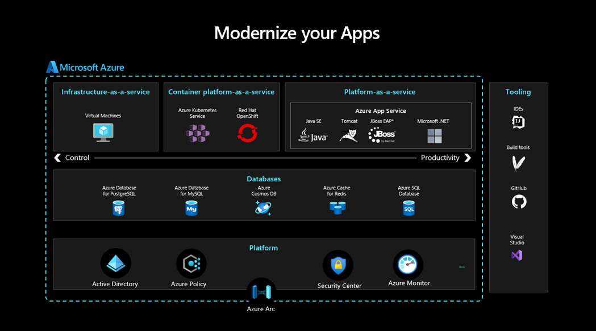
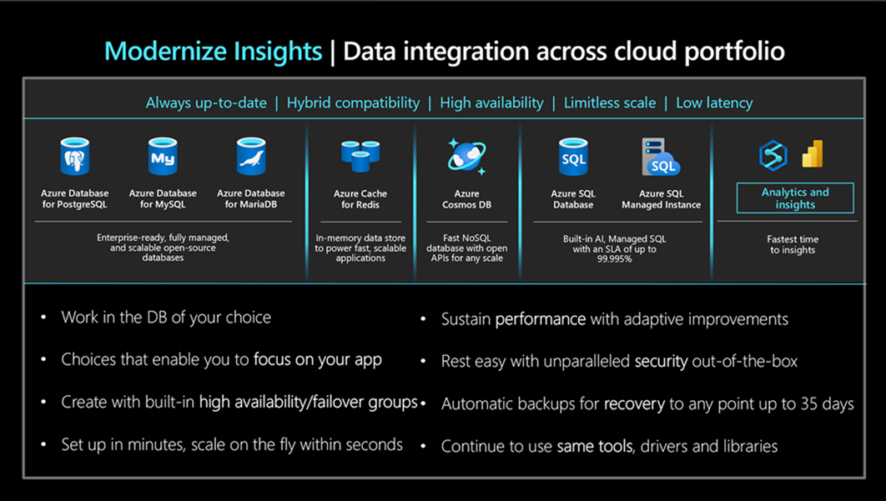
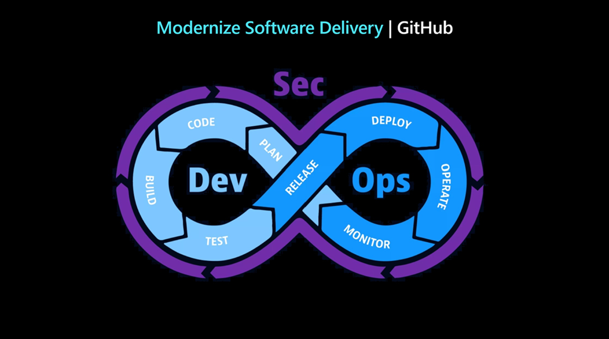
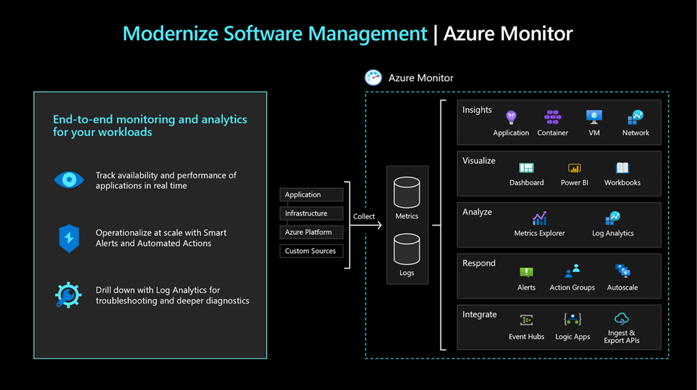

#
#
# Module 1 - Modernization Overview

In this module we provide an overview of what a legacy app modernization effort looks like. We cover the following topics:

- VWhat does success with app modernization look like for you?
- Modernizing your app
- Modernizing your software delivery and management

## What does success look like for you?

For app modernization projects to succeed the important thing is to align the technology to your business needs. What outcomes are you seeking from this project? What are your priorities and success criteria for the app modernization projects in mind? We want to tailor the rest of this session to your business outcomes.  

Based on our conversations with customers, we identified three business outcomes that are top of mind for most:

1. Security and performance is a top priority with all Federal agencies. Integrate security, resilience, and performance throughout the entire software development lifecycle to enable teams to deliver secure, high-quality software at a global scale quicker than ever before.
2. Reign in unmanaged enterprise IT spread. Avoid overkill that runs up unnecessary costs and risk where it is not justified by the business case. Mitigate the skill shortage by using readily available technologies and platforms.
3. App innovation is the reason we’re all here to begin with. Provide the best tools and technologies so developer teams focus single-mindedly on innovating at the speed and quality that is required to meet the needs of your enterprise users. 

## Modernizing your app

Modernizing your legacy app requires careful planning and intentional design. To achieve success, you must modernize the architecture of your app, your data and your platforms, as shown in the architecture diagram below.   

It is best to start with a completely reimagined, modern approach for your app. From there, you can begin to plan the supporting architecture components such as:

* On what hosting platform your app will run
* Where the data will reside
* How you will secure the app and the data
* Integrations with other internal and external systems
* How you will monitor and manage the app and data
* What tooling you will use to build the modern app

### Modernizing your app codebase

Once you have designed the architecture, you can then design your approach for migrating your legacy app. That could mean one of the following approaches:

* Complete code rewrite
* Complete migration of code to modern .NET and refactor as necessary
* Decide for each module whether to migrate or rewrite and refactor code

### Modernizing your app data

Data availability and integration across the enterprise is critical now, more than ever. Evaluating your current legacy app datastore is critical in the context of your enterprise data portfolio. The characteristiics of the data you should evaluate are:
* Source of the data
* Structure and format of the data
* How the data is used downstream, and by whom

With this information, you can make decisions about how to restructure the data, how to make it readily available to those who need it and, most importantly, how to make it unavailable to everyone else.

## Modernizing your software delivery and management
Modern organizations require modern development, operations and security practices to keep up with the rapid pace of change. To keep up with these changes, software development teams must use modern ptools and processes to deliver new or improved software faster and ensure that apps are available. Two of the most important practices are:

* DevOps/DevSecOps
* Proactive Application Monitoring

DevOps and DevSecOps are complimentary processes increase the velocity of app development through automation, continuous integration of new and changed code, continuous security monitoring, and continuous delivery of new functionality to end users.

Proactive app monitoring provides real-time awareness of app availability and performance. Using techniques such as ping testing and synthetic transactions, proactive app monitoring helps app developers improve their apps and identify issues before they impact end users.  

