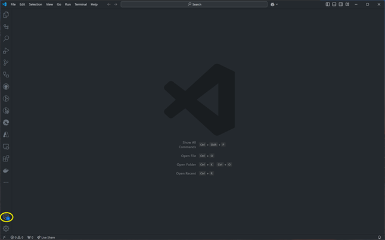
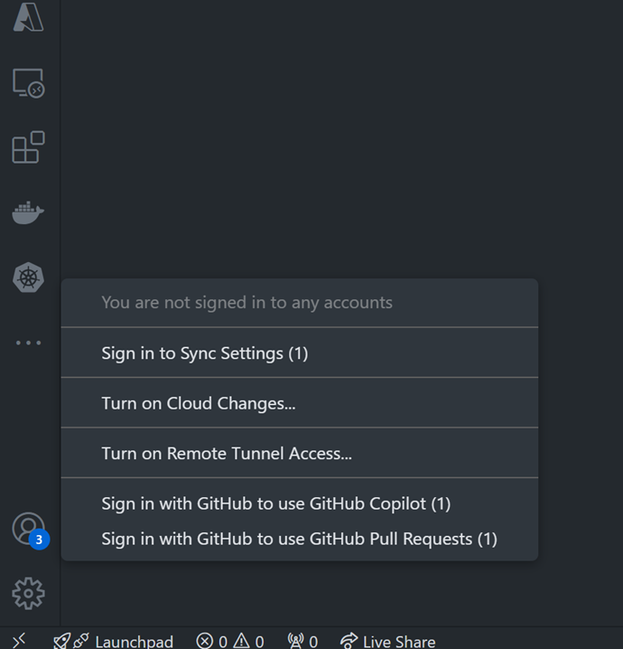

#
# Module 2 - Required Tooling
Before we start, there are 3 tasks we need to complete in order to complete the workshop:

- [Install local development tooling](#install-local-development-tooling)
- [Setup the Git Repo](#setup-the-git-repo)
- [Authenticate development tooling with Azure](#authenticate-development-tooling-with-azure)

## Install local development tooling

To complete the workshop, development tools that are installed locally on our laptops or desktop computers will be required.

We will install the following local tools:

- Windows 11
- [PowerShell 7.4 (or above)](https://learn.microsoft.com/en-us/powershell/scripting/install/installing-powershell-on-windows)
- [Git](https://github.com/git-guides/install-git)
- [Azure CLI (2.62.0 or above)](https://docs.microsoft.com/cli/azure/install-azure-cli)
- [Azure CLI Bicep extension (0.30.00 or above)](https://learn.microsoft.com/en-us/azure/azure-resource-manager/bicep/install#azure-cli)
- [Azure Developer CLI (latest)](https://learn.microsoft.com/azure/developer/azure-developer-cli/install-azd)
- [Visual Studio Code 1.90 (or above)](https://code.visualstudio.com/)
- [SQLite local database engine](https://sqlite.org/download.html)

## Setup the Git repo
We will each need a copy of the Git repo. This repo will have the instructions for completing each module and well as the source code for each of your .NET projects.

### Create a GitHub account
If necessary, create a GitHub account using your workshop credentials.

* Navigate to the [GitHub home page](https://github.com/). You should see the following:


* Click on the **Sign Up** button on the top right of the home page.
* Enter your email address and click **Continue**
* Enter your password and click **Continue**
* Enter a username and click **Continue**. Examples:
  - \<firstname\>\<lastname\> (loublick)
  - \<firstname\>\<lastname\>_\<org\> (loublick_microsoft)

### Fork the Git Repo

* Navigate to the [GitHub repo](https://github.com/lblick/modernizing-ent-apps-with-dotnet-workshop). You should see the following:


* Click on the Fork dropdown (circled in yellow):

 

* Create a new fork of the repo by selecting your GitHub username in the Owner dropdown (circled in yellow) and click **Create fork**


### Clone the forked Git repo

* Navigate to a folder where you want your local Git repo downloaded to.
* Clone your forked Git repo by executing the following command, replacing **\<username\>** with your GitHub username:

```powershell
git clone "https://github.com/<username>/modernizing-ent-apps-with-dotnet-workshop"
```
* Navigate to the repo folder:

```powershell
cd "modernizing-ent-apps-with-dotnet-workshop"
```

## Authenticate development tooling with Azure

Before we can start developing, we need to authenticate all of the developer tooling with Azure.

### Sign in to Azure from Visual Studio Code

1. Open Visual Studio Code
2. Click on **Accounts** in the Activity Bar on the far let of the window (circled in yellow below)

    


3. In the Accounts pop-up menu, select **Sign-in with GitHub...**.

    


### Authenticate the Azure CLI and Azure Developer CLI

* Open a PowerShell prompt and run the following command to authenticate the Azure CLI:

    ```powershell
    az login
    ```

    It should open a browser window and ask you to log in to Azure.
    
    
    
    Use the credentials you received for this workshop.

* Run the following command to authenticate the Azure Developer CLI:

    ```powershell
    azd auth login
    ```

    It should open a browser window and ask you to log in to Azure. Ideally, the browser will have cached your credentials from before and you can select that account. If not, log in with the same credentials as the step above.

