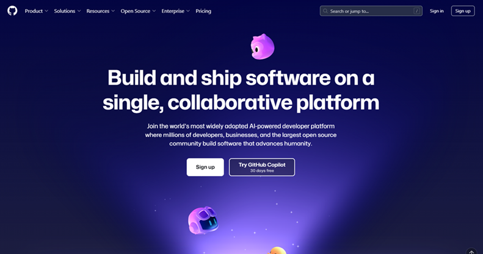
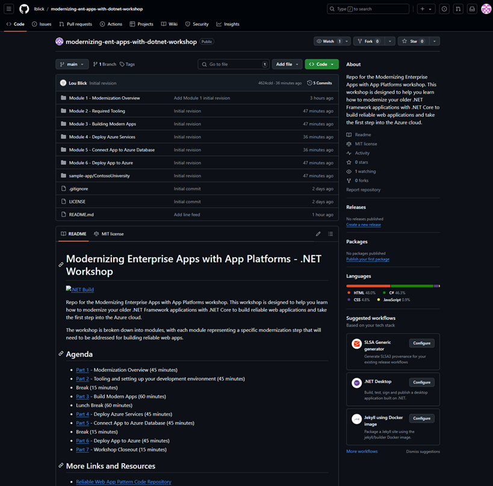

#
# Module 2 - Required Tooling
Before we start the workshop, there are 3 things we need to set up.

- [Local development tooling](#local-development-tooling)
- [Authenticate development tooling with Azure](#authenticate-development-tooling-with-azure)
  - [Sign in to Azure from Visual Studio](#sign-in-to-azure-from-visual-studio)
  - [Authenticate the Azure CLI and Azure Developer CLI](#authenticate-the-azure-cli-and-azure-developer-cli)
- [Setup the Git Repo](#setup-the-git-repo)

## Local development tooling

The following tools are needed to run the workshop locally:

- Windows 11
- [PowerShell 7.4 (or above)](https://learn.microsoft.com/en-us/powershell/scripting/install/installing-powershell-on-windows)
- [Git](https://github.com/git-guides/install-git)
- [Azure CLI (2.62.0 or above)](https://docs.microsoft.com/cli/azure/install-azure-cli)
- [Azure CLI Bicep extension (0.30.00 or above)](https://learn.microsoft.com/en-us/azure/azure-resource-manager/bicep/install#azure-cli)
- [Azure Developer CLI (latest)](https://learn.microsoft.com/azure/developer/azure-developer-cli/install-azd)
- [Visual Studio 2022 Community Edition (or above)](https://visualstudio.microsoft.com/vs/)
  - ASP.NET workload
  - Azure workload

## Authenticate development tooling with Azure

Before we can start developing, we need to authenticate all of the developer tooling with Azure.

### Sign in to Azure from Visual Studio

* Open Visual Studio.
* Open the **File** menu and choose **Account Settings**.
* Under the **Sign in to Visual Studio** heading, click the **Sign in** button. Use the credentials you were given for this workshop.

    

   > If you get prompted to set up Microsoft Authenticator, choose **Ask Later** and set it up when setting up the Azure CLI (below).

* After going through the web-based authentication flow, you should see your account listed under the **Personalization Account** and **All Accounts** sections.

    

### Authenticate the Azure CLI and Azure Developer CLI

* Open a PowerShell prompt and run the following command to authenticate the Azure CLI:

    ```powershell
    az login
    ```

    It should open a browser window and ask you to log in to Azure.
    
    
    
    Use the credentials you received for this workshop.

* Run the following command to authenticate the Azure Developer CLI:

    ```powershell
    azd auth login
    ```

    It should open a browser window and ask you to log in to Azure. Ideally, the browser will have cached your credentials from before and you can select that account. If not, log in with the same credentials as the step above.

## Setup the Git repo
### Create a GitHub account
If necessary, create a GitHub account using your workshop credentials.

* Navigate to the [GitHub home page](https://github.com/). You should see the following:



* Click on the **Sign Up** button on the top right of the home page.
* Enter your email address and click **Continue**
* Enter your password and click **Continue**
* Enter a username and click **Continue**. Examples:
  - \<firstname\>\<lastname\> (loublick)
  - \<firstname\>\<lastname\>_\<org\> (loublick_microsoft)

### Fork the Git Repo

* Navigate to the [GitHub repo](https://github.com/lblick/modernizing-ent-apps-with-dotnet-workshop). You should see the following:



* Click on the Fork dropdown (circled in yellow):

 

* Create a new fork of the repo by selecting your GitHub username in the Owner dropdown (circled in yellow) and click **Create fork**


### Clone the Git repo

* Navigate to a folder where you want your local Git repo located
* Clone your forked Git repo
  - Replace \<username\> with your GitHub username

```powershell
git clone "https://github.com/<username>/modernizing-ent-apps-with-dotnet-workshop"
```
* Navigate to the repo folder:

```powershell
cd "modernizing-ent-apps-with-dotnet-workshop"
```

