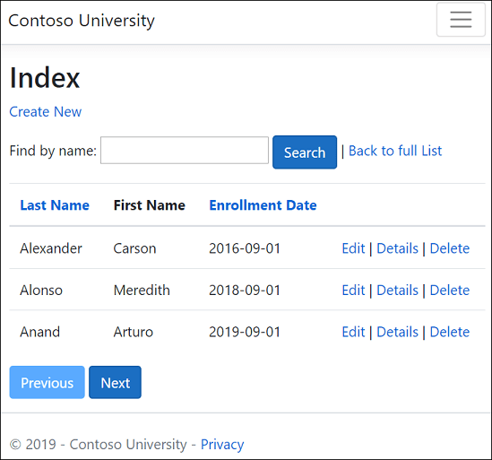
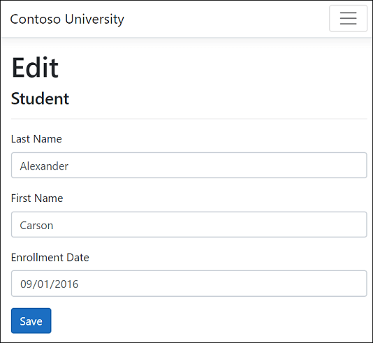

#
# Module 3 - Building a Modern .NET Web App
This lab will walk through the steps for building a modern ASP.NET Core web app using Razor pages and C#. The app will access a SQL database using Entity Framework (EF), an object-relational mapper that enables .NET developers to work with relational data using domain-specific objects.

## Prerequisites
- Visual Studio Code with the ASP.NET and web development workload.
- .NET 8.0 or Higher SDK
- SQLite Database engine

## Sample App
The app built in these labs is a basic university web site. Users can view and update student, course, and instructor information. Here are a few of the screens created in the tutorial.

* Student index page



* Student edit page



The UI style of this site is based on the built-in project templates. The tutorial's focus is on how to use EF Core with ASP.NET Core, not how to customize the UI.

### Create the web app project
1. Launch Visual Studio Code.
2. Click **File -> Open Folder...** to open the folder of your local repo created in the previous module.
3. Press **F1** on your keyboard to open the VSCode command pallette.
4. Select **.NET: New Project**.
5. In the command pallette, select ASP.NET Core Web App (Razor Pages).
6. Change the name of the app to **ContosoUniversity** and press **Enter**. It is important to name the project ContosoUniversity, including matching the capitalization, so the namespaces will match when you copy and paste example code.
7. Select **Choose another directory...**.
8. Select the **./apps** folder and click **OK**.
9. Select **Show template options...**.
10. For the **Framework** option, select .NET 8.0 (Long Term Support) and then select **Create project**.

### Set up the Site Style
1. Copy and paste the following code into the Pages/Shared/_Layout.cshtml file:

```html
<!DOCTYPE html>
<html lang="en">
<head>
    <meta charset="utf-8" />
    <meta name="viewport" content="width=device-width, initial-scale=1.0" />
    <title>@ViewData["Title"] - Contoso University</title>
    <link rel="stylesheet" href="~/lib/bootstrap/dist/css/bootstrap.css" />
    <link rel="stylesheet" href="~/css/site.css" asp-append-version="true" />
    <link rel="stylesheet" href="~/ContosoUniversity.styles.css" asp-append-version="true" />
</head>
<body>
    <header>
        <nav class="navbar navbar-expand-sm navbar-toggleable-sm navbar-light bg-white border-bottom box-shadow mb-3">
            <div class="container">
                <a class="navbar-brand" asp-area="" asp-page="/Index">Contoso University</a>
                <button class="navbar-toggler" type="button" data-bs-toggle="collapse" data-bs-target=".navbar-collapse" aria-controls="navbarSupportedContent"
                        aria-expanded="false" aria-label="Toggle navigation">
                    <span class="navbar-toggler-icon"></span>
                </button>
                <div class="navbar-collapse collapse d-sm-inline-flex justify-content-between">
                    <ul class="navbar-nav flex-grow-1">                        
                        <li class="nav-item">
                            <a class="nav-link text-dark" asp-area="" asp-page="/About">About</a>
                        </li>
                        <li class="nav-item">
                            <a class="nav-link text-dark" asp-area="" asp-page="/Students/Index">Students</a>
                        </li>
                        <li class="nav-item">
                            <a class="nav-link text-dark" asp-area="" asp-page="/Courses/Index">Courses</a>
                        </li>
                        <li class="nav-item">
                            <a class="nav-link text-dark" asp-area="" asp-page="/Instructors/Index">Instructors</a>
                        </li>
                        <li class="nav-item">
                            <a class="nav-link text-dark" asp-area="" asp-page="/Departments/Index">Departments</a>
                        </li>
                    </ul>
                </div>
            </div>
        </nav>
    </header>
    <div class="container">
        <main role="main" class="pb-3">
            @RenderBody()
        </main>
    </div>

    <footer class="border-top footer text-muted">
        <div class="container">
            &copy; 2021 - Contoso University - <a asp-area="" asp-page="/Privacy">Privacy</a>
        </div>
    </footer>

    <script src="~/lib/jquery/dist/jquery.js"></script>
    <script src="~/lib/bootstrap/dist/js/bootstrap.bundle.js"></script>
    <script src="~/js/site.js" asp-append-version="true"></script>

    @await RenderSectionAsync("Scripts", required: false)
</body>
</html>
```

The layout file sets the site header, footer, and menu. The preceding code makes the following changes:
- Each occurrence of "ContosoUniversity" to "Contoso University". There are three occurrences.
- The Home and Privacy menu entries are deleted.
- Entries are added for About, Students, Courses, Instructors, and Departments.

2. In Pages/Index.cshtml, replace the contents of the file with the following code:

```html
@page
@model IndexModel
@{
    ViewData["Title"] = "Home page";
}

<div class="row mb-auto">
    <div class="col-md-4">
        <div class="row no-gutters border mb-4">
            <div class="col p-4 mb-4 ">
                <p class="card-text">
                    Contoso University is a sample application that
                    demonstrates how to use Entity Framework Core in an
                    ASP.NET Core Razor Pages web app.
                </p>
            </div>
        </div>
    </div>
    <div class="col-md-4">
        <div class="row no-gutters border mb-4">
            <div class="col p-4 d-flex flex-column position-static">
                <p class="card-text mb-auto">
                    You can build the application by following the steps in a series of tutorials.
                </p>
                <p>
@*                    <a href="https://docs.microsoft.com/aspnet/core/data/ef-rp/intro" class="stretched-link">See the tutorial</a>
*@                </p>
            </div>
        </div>
    </div>
    <div class="col-md-4">
        <div class="row no-gutters border mb-4">
            <div class="col p-4 d-flex flex-column">
                <p class="card-text mb-auto">
                    You can download the completed project from GitHub.
                </p>
                <p>
@*                    <a href="https://github.com/dotnet/AspNetCore.Docs/tree/main/aspnetcore/data/ef-rp/intro/samples" class="stretched-link">See project source code</a>
*@                </p>
            </div>
        </div>
    </div>
</div>
```

The preceding code replaces the text about ASP.NET Core with text about this app.

3. Run the app to verify that the new home page appears.

### Create the Data Model
The following sections create a data model for the application.

#### Course Enrollment Entity


A student can enroll in any number of courses, and a course can have any number of students enrolled in it.

#### Student Entity


1. Create a Models folder in the project folder.
2. Create Models/Student.cs with the following code:

```C#
namespace ContosoUniversity.Models
{
    public class Student
    {
        public int ID { get; set; }
        public string LastName { get; set; }
        public string FirstMidName { get; set; }
        public DateTime EnrollmentDate { get; set; }

        public ICollection<Enrollment> Enrollments { get; set; }
    }
}
```

The ID property becomes the primary key column of the database table that corresponds to this class. By default, EF Core interprets a property that's named ID or classnameID as the primary key. So the alternative automatically recognized name for the Student class primary key is StudentID. For more information, see .

The Enrollments property is a navigation property. Navigation properties hold other entities that are related to this entity. In this case, the Enrollments property of a Student entity holds all of the Enrollment entities that are related to that Student. For example, if a Student row in the database has two related Enrollment rows, the Enrollments navigation property contains those two Enrollment entities.

In the database, an Enrollment row is related to a Student row if its StudentID column contains the student's ID value. For example, suppose a Student row has ID=1. Related Enrollment rows will have StudentID = 1. StudentID is a foreign key in the Enrollment table.

The Enrollments property is defined as ICollection<Enrollment> because there may be multiple related Enrollment entities. Other collection types can be used, such as List<Enrollment> or HashSet<Enrollment>. When ICollection<Enrollment> is used, EF Core creates a HashSet<Enrollment> collection by default.

#### Enrollment Entity


1. Create Models/Enrollment.cs with the following code:

```C#
using System.ComponentModel.DataAnnotations;

namespace ContosoUniversity.Models
{
    public enum Grade
    {
        A, B, C, D, F
    }

    public class Enrollment
    {
        public int EnrollmentID { get; set; }
        public int CourseID { get; set; }
        public int StudentID { get; set; }
        [DisplayFormat(NullDisplayText = "No grade")]
        public Grade? Grade { get; set; }

        public Course Course { get; set; }
        public Student Student { get; set; }
    }
}
```

The EnrollmentID property is the primary key; this entity uses the classnameID pattern instead of ID by itself. For a production data model, many developers choose one pattern and use it consistently. This tutorial uses both just to illustrate that both work. Using ID without classname makes it easier to implement some kinds of data model changes.

The Grade property is an enum. The question mark after the Grade type declaration indicates that the Grade property is nullable. A grade that is null is different from a zero grade—null means a grade isn't known or hasn't been assigned yet.

The StudentID property is a foreign key, and the corresponding navigation property is Student. An Enrollment entity is associated with one Student entity, so the property contains a single Student entity.

The CourseID property is a foreign key, and the corresponding navigation property is Course. An Enrollment entity is associated with one Course entity.

EF Core interprets a property as a foreign key if it is named <navigation property name><primary key property name>. For example, StudentID is the foreign key for the Student navigation property, since the primary key for the Student entity is ID. Foreign key properties can also be named <primary key property name>. For example, CourseID since the Course entity's primary key is CourseID.

#### Course Entity


1. Create Models/Course.cs with the following code:

```C#

using System.ComponentModel.DataAnnotations.Schema;

namespace ContosoUniversity.Models
{
    public class Course
    {
        [DatabaseGenerated(DatabaseGeneratedOption.None)]
        public int CourseID { get; set; }
        public string Title { get; set; }
        public int Credits { get; set; }

        public ICollection<Enrollment> Enrollments { get; set; }
    }
}
```

The Enrollments property is a navigation property. A Course entity can be related to any number of Enrollment entities.

The DatabaseGenerated attribute allows the app to specify the primary key rather than having the database generate it.

Build the app. The compiler generates several warnings about how null values are handled. See the following documentation for more information on nullable types.
- 
- 
- 

To eliminate the warnings from nullable reference types, remove the following line from the ContosoUniversity.csproj file:

```XML

<Nullable>enable</Nullable>
```

The scaffolding engine currently does not support nullable reference types, therefore the models used in scaffold can't either.

Remove the ? nullable reference type annotation from `public string? RequestId { get; set; }` in Pages/Error.cshtml.cs so the project builds without compiler warnings.

#### Scaffold Student Pages
In this section, the ASP.NET Core scaffolding tool is used to generate:

- An EF Core DbContext class. The context is the main class that coordinates Entity Framework functionality for a given data model. It derives from the Microsoft.EntityFrameworkCore.DbContext class.
- Razor pages that handle Create, Read, Update, and Delete (CRUD) operations for the Student entity.

1. Create a Pages/Students folder.
2. In Solution Explorer, right-click the Pages/Students folder and select Add > New Scaffolded Item.
3. In the Add New Scaffold Item dialog:
   - In the left tab, select Installed->Common->Razor Pages
   - Select Razor Pages using Entity Framework (CRUD)
   - Click Add.
4. In the Add Razor Pages using Entity Framework (CRUD) dialog:
   - In the Model class drop-down, select Student (ContosoUniversity.Models).
   - In the Data context class row, select the + (plus) sign.
     * Change the data context name to end in SchoolContext rather than ContosoUniversityContext. The updated context name: ContosoUniversity.Data.SchoolContext
     * Select Add to finish adding the data context class.
     * Select SQLite for the Database provider.
     * Select Add to finish the Add Razor Pages dialog.

The following packages are automatically installed:

- `Microsoft.EntityFrameworkCore.Sqlite`
- `Microsoft.EntityFrameworkCore.Tools`
- `Microsoft.VisualStudio.Web.CodeGeneration.Design`

If the preceding step fails, build the project and retry the scaffold step.

The scaffolding process:

- Generates the following Razor pages in the `Pages/Students` folder:
  - `Create.cshtml` and `Create.cshtml.cs`
  - `Delete.cshtml` and `Delete.cshtml.cs`
  - `Details.cshtml` and `Details.cshtml.cs`
  - `Edit.cshtml` and `Edit.cshtml.cs`
  - `Index.cshtml` and `Index.cshtml.cs`
- Creates `Data/SchoolContext.cs`
- Adds the context to dependency injection in `Program.cs`.
- Adds a database connection string to `appsettings.json`.

Database connection string
The scaffolding tool generates a connection string in the `appsettings.json` file.

The connection string specifies the SQLite local database in the `SchoolContext` connection string:

```JSON
{
  "Logging": {
    "LogLevel": {
      "Default": "Information",
      "Microsoft.AspNetCore": "Warning"
    }
  },
  "AllowedHosts": "*",
  "ConnectionStrings": {
    "SchoolContext": "Data Source=SchoolContext-08214d62-8ff5-4b7c-8576-fc8c7a96f005.db"
  }
}
```

SQLite is a lightweight SQL database engine and is intended for app development, not production use. By default, SQLite creates a `.db` file in the C:/Users/<user> directory.

#### Update the database context class
The main class that coordinates EF Core functionality for a given data model is the database context class. The context is derived from Microsoft.EntityFrameworkCore.DbContext. The context specifies which entities are included in the data model. In this project, the class is named SchoolContext.

1. Update Data/SchoolContext.cs with the following code:

```C#

using Microsoft.EntityFrameworkCore;
using ContosoUniversity.Models;

namespace ContosoUniversity.Data
{
    public class SchoolContext : DbContext
    {
        public SchoolContext (DbContextOptions<SchoolContext> options)
            : base(options)
        {
        }

        public DbSet<Student> Students { get; set; }
        public DbSet<Enrollment> Enrollments { get; set; }
        public DbSet<Course> Courses { get; set; }

        protected override void OnModelCreating(ModelBuilder modelBuilder)
        {
            modelBuilder.Entity<Course>().ToTable("Course");
            modelBuilder.Entity<Enrollment>().ToTable("Enrollment");
            modelBuilder.Entity<Student>().ToTable("Student");
        }
    }
}
```

The preceding code changes from the singular `DbSet<Student> Student` to the plural `DbSet<Student> Students`. To make the Razor Pages code match the new DBSet name, make a global change from: `_context.Student.` to: `_context.Students`.

There are 8 occurrences.

Because an entity set contains multiple entities, many developers prefer the DBSet property names should be plural. The highlighted code:

- Creates a DbSet<TEntity> property for each entity set. In EF Core terminology:
  * An entity set typically corresponds to a database table.
  * An entity corresponds to a row in the table.
- Calls OnModelCreating. OnModelCreating:
  * Is called when SchoolContext has been initialized but before the model has been secured and used to initialize the context.
  * Is required because later in the tutorial the Student entity will have references to the other entities.


### Program.cs
ASP.NET Core is built with dependency injection. Services such as the SchoolContext are registered with dependency injection during app startup. Components that require these services, such as Razor Pages, are provided these services via constructor parameters. The constructor code that gets a database context instance is shown later in the tutorial.

The scaffolding tool automatically registered the context class with the dependency injection container.

The following highlighted lines were added by the scaffolder:

```C#

using ContosoUniversity.Data;
using Microsoft.EntityFrameworkCore;
var builder = WebApplication.CreateBuilder(args);

builder.Services.AddRazorPages();

builder.Services.AddDbContext<SchoolContext>(options =>
  options.UseSqlServer(builder.Configuration.GetConnectionString("SchoolContext")));
```

The name of the connection string is passed in to the context by calling a method on a `DbContextOptions` object. For local development, the ASP.NET Core configuration system reads the connection string from the `appsettings.json` or the `appsettings.Development.json` file.


1. Add the database exception filter. Add AddDatabaseDeveloperPageExceptionFilter and UseMigrationsEndPoint as shown in the following code:

```C#

using ContosoUniversity.Data;
using Microsoft.EntityFrameworkCore;
var builder = WebApplication.CreateBuilder(args);

builder.Services.AddRazorPages();

builder.Services.AddDbContext<SchoolContext>(options =>
  options.UseSqlServer(builder.Configuration.GetConnectionString("SchoolContext")));

builder.Services.AddDatabaseDeveloperPageExceptionFilter();

var app = builder.Build();

if (!app.Environment.IsDevelopment())
{
    app.UseExceptionHandler("/Error");
    app.UseHsts();
}
else
{
    app.UseDeveloperExceptionPage();
    app.UseMigrationsEndPoint();
}
```

2. Add the `Microsoft.AspNetCore.Diagnostics.EntityFrameworkCore` NuGet package. In the Visual Studio terminal, enter the following to add the NuGet package:

```PowerShell

Install-Package Microsoft.AspNetCore.Diagnostics.EntityFrameworkCore
```

The Microsoft.AspNetCore.Diagnostics.EntityFrameworkCore NuGet package provides ASP.NET Core middleware for Entity Framework Core error pages. This middleware helps to detect and diagnose errors with Entity Framework Core migrations.

The AddDatabaseDeveloperPageExceptionFilter provides helpful error information in the development environment for EF migrations errors.

3. Create the database. Update `Program.cs` to create the database if it doesn't exist:

```C#

using ContosoUniversity.Data;
using Microsoft.EntityFrameworkCore;
var builder = WebApplication.CreateBuilder(args);

builder.Services.AddRazorPages();

builder.Services.AddDbContext<SchoolContext>(options =>
  options.UseSqlServer(builder.Configuration.GetConnectionString("SchoolContext")));

builder.Services.AddDatabaseDeveloperPageExceptionFilter();

var app = builder.Build();

if (!app.Environment.IsDevelopment())
{
    app.UseExceptionHandler("/Error");
    app.UseHsts();
}
else
{
    app.UseDeveloperExceptionPage();
    app.UseMigrationsEndPoint();
}

using (var scope = app.Services.CreateScope())
{
    var services = scope.ServiceProvider;

    var context = services.GetRequiredService<SchoolContext>();
    context.Database.EnsureCreated();
    // DbInitializer.Initialize(context);
}

app.UseHttpsRedirection();
app.UseStaticFiles();

app.UseRouting();

app.UseAuthorization();

app.MapRazorPages();

app.Run();
```

The EnsureCreated method takes no action if a database for the context exists. If no database exists, it creates the database and schema. EnsureCreated enables the following workflow for handling data model changes:

- Delete the database. Any existing data is lost.
- Change the data model. For example, add an EmailAddress field.
- Run the app.
- EnsureCreated creates a database with the new schema.

This workflow works early in development when the schema is rapidly evolving, as long as data doesn't need to be preserved. The situation is different when data that has been entered into the database needs to be preserved. When that is the case, use migrations.

Later in the tutorial series, the database is deleted that was created by EnsureCreated and migrations is used. A database that is created by EnsureCreated cannot be updated by using migrations.

4. Test the app

- Run the app.
- Select the Students link and then Create New.
- Test the Edit, Details, and Delete links.

#### Seed the database
The EnsureCreated method creates an empty database. This section adds code that populates the database with test data.

Create Data/DbInitializer.cs with the following code:

C#

Copy
using ContosoUniversity.Models;

namespace ContosoUniversity.Data
{
    public static class DbInitializer
    {
        public static void Initialize(SchoolContext context)
        {
            // Look for any students.
            if (context.Students.Any())
            {
                return;   // DB has been seeded
            }

            var students = new Student[]
            {
                new Student{FirstMidName="Carson",LastName="Alexander",EnrollmentDate=DateTime.Parse("2019-09-01")},
                new Student{FirstMidName="Meredith",LastName="Alonso",EnrollmentDate=DateTime.Parse("2017-09-01")},
                new Student{FirstMidName="Arturo",LastName="Anand",EnrollmentDate=DateTime.Parse("2018-09-01")},
                new Student{FirstMidName="Gytis",LastName="Barzdukas",EnrollmentDate=DateTime.Parse("2017-09-01")},
                new Student{FirstMidName="Yan",LastName="Li",EnrollmentDate=DateTime.Parse("2017-09-01")},
                new Student{FirstMidName="Peggy",LastName="Justice",EnrollmentDate=DateTime.Parse("2016-09-01")},
                new Student{FirstMidName="Laura",LastName="Norman",EnrollmentDate=DateTime.Parse("2018-09-01")},
                new Student{FirstMidName="Nino",LastName="Olivetto",EnrollmentDate=DateTime.Parse("2019-09-01")}
            };

            context.Students.AddRange(students);
            context.SaveChanges();

            var courses = new Course[]
            {
                new Course{CourseID=1050,Title="Chemistry",Credits=3},
                new Course{CourseID=4022,Title="Microeconomics",Credits=3},
                new Course{CourseID=4041,Title="Macroeconomics",Credits=3},
                new Course{CourseID=1045,Title="Calculus",Credits=4},
                new Course{CourseID=3141,Title="Trigonometry",Credits=4},
                new Course{CourseID=2021,Title="Composition",Credits=3},
                new Course{CourseID=2042,Title="Literature",Credits=4}
            };

            context.Courses.AddRange(courses);
            context.SaveChanges();

            var enrollments = new Enrollment[]
            {
                new Enrollment{StudentID=1,CourseID=1050,Grade=Grade.A},
                new Enrollment{StudentID=1,CourseID=4022,Grade=Grade.C},
                new Enrollment{StudentID=1,CourseID=4041,Grade=Grade.B},
                new Enrollment{StudentID=2,CourseID=1045,Grade=Grade.B},
                new Enrollment{StudentID=2,CourseID=3141,Grade=Grade.F},
                new Enrollment{StudentID=2,CourseID=2021,Grade=Grade.F},
                new Enrollment{StudentID=3,CourseID=1050},
                new Enrollment{StudentID=4,CourseID=1050},
                new Enrollment{StudentID=4,CourseID=4022,Grade=Grade.F},
                new Enrollment{StudentID=5,CourseID=4041,Grade=Grade.C},
                new Enrollment{StudentID=6,CourseID=1045},
                new Enrollment{StudentID=7,CourseID=3141,Grade=Grade.A},
            };

            context.Enrollments.AddRange(enrollments);
            context.SaveChanges();
        }
    }
}
The code checks if there are any students in the database. If there are no students, it adds test data to the database. It creates the test data in arrays rather than List<T> collections to optimize performance.

In Program.cs, remove // from the DbInitializer.Initialize line:
C#

Copy
using (var scope = app.Services.CreateScope())
{
    var services = scope.ServiceProvider;

    var context = services.GetRequiredService<SchoolContext>();
    context.Database.EnsureCreated();
    DbInitializer.Initialize(context);
}
Visual Studio
Visual Studio Code
Stop the app if it's running, and run the following command in the Package Manager Console (PMC):

PowerShell

Copy
Drop-Database -Confirm

Respond with Y to delete the database.

Restart the app.
Select the Students page to see the seeded data.
View the database
Visual Studio
Visual Studio Code
Open SQL Server Object Explorer (SSOX) from the View menu in Visual Studio.
In SSOX, select (localdb)\MSSQLLocalDB > Databases > SchoolContext-{GUID}. The database name is generated from the context name provided earlier plus a dash and a GUID.
Expand the Tables node.
Right-click the Student table and click View Data to see the columns created and the rows inserted into the table.
Right-click the Student table and click View Code to see how the Student model maps to the Student table schema.
Asynchronous EF methods in ASP.NET Core web apps
Asynchronous programming is the default mode for ASP.NET Core and EF Core.

A web server has a limited number of threads available, and in high load situations all of the available threads might be in use. When that happens, the server can't process new requests until the threads are freed up. With synchronous code, many threads may be tied up while they aren't doing work because they're waiting for I/O to complete. With asynchronous code, when a process is waiting for I/O to complete, its thread is freed up for the server to use for processing other requests. As a result, asynchronous code enables server resources to be used more efficiently, and the server can handle more traffic without delays.

Asynchronous code does introduce a small amount of overhead at run time. For low traffic situations, the performance hit is negligible, while for high traffic situations, the potential performance improvement is substantial.

In the following code, the async keyword, Task return value, await keyword, and ToListAsync method make the code execute asynchronously.

C#

Copy
public async Task OnGetAsync()
{
    Students = await _context.Students.ToListAsync();
}
The async keyword tells the compiler to:
Generate callbacks for parts of the method body.
Create the Task object that's returned.
The Task return type represents ongoing work.
The await keyword causes the compiler to split the method into two parts. The first part ends with the operation that's started asynchronously. The second part is put into a callback method that's called when the operation completes.
ToListAsync is the asynchronous version of the ToList extension method.
Some things to be aware of when writing asynchronous code that uses EF Core:

Only statements that cause queries or commands to be sent to the database are executed asynchronously. That includes ToListAsync, SingleOrDefaultAsync, FirstOrDefaultAsync, and SaveChangesAsync. It doesn't include statements that just change an IQueryable, such as var students = context.Students.Where(s => s.LastName == "Davolio").
An EF Core context isn't thread safe: don't try to do multiple operations in parallel.
To take advantage of the performance benefits of async code, verify that library packages (such as for paging) use async if they call EF Core methods that send queries to the database.
For more information about asynchronous programming in .NET, see Async Overview and Asynchronous programming with async and await.

 Warning

The async implementation of Microsoft.Data.SqlClient has some known issues (#593, #601, and others). If you're seeing unexpected performance problems, try using sync command execution instead, especially when dealing with large text or binary values.

Performance considerations
In general, a web page shouldn't be loading an arbitrary number of rows. A query should use paging or a limiting approach. For example, the preceding query could use Take to limit the rows returned:

C#

Copy
public async Task OnGetAsync()
{
    Student = await _context.Students.Take(10).ToListAsync();
}
Enumerating a large table in a view could return a partially constructed HTTP 200 response if a database exception occurs part way through the enumeration.

Paging is covered later in the tutorial.

For more information, see Performance considerations (EF).

