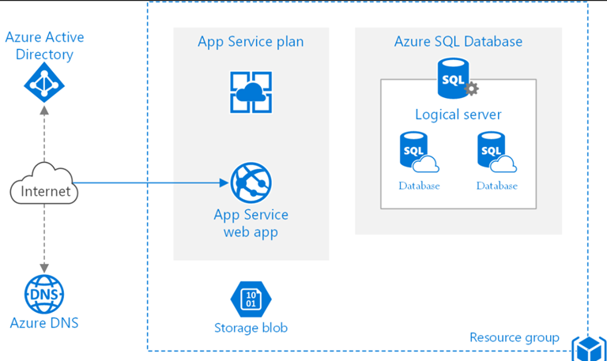

#
# Deploy Azure Services

In this module, we will deploy the Azure Cloud services needed to support the app. We will cover Azure and app deployment to Azure, covering the following:
- Working with Azure Cloud
- Deploying Azure resources
- Deploying the .NET app
- Connecting the app to an Azure SQL database

## Working with Microsoft Azure Cloud
Azure is a comprehensive cloud computing platform developed by Microsoft. It offers over 200 products and cloud services designed to help businesses bring new solutions to life, solve current challenges, and create future innovations. Azure allows you to build, run, and manage applications across multiple clouds, on-premises, and at the edge, using the tools and frameworks of your choice.

### Key Features and Benefits
- **Security and Compliance**: Azure provides security from the ground up, backed by a team of experts and proactive compliance trusted by enterprises, governments, and startups. Microsoft invests $1 billion annually in security to protect customer data from cyber threats
- **Hybrid Cloud Capabilities**: Azure supports seamless hybrid cloud operations, allowing integration and management of environments across on-premises, multiple clouds, and edge locations
- **Open Source and Flexibility**: Azure supports open-source technologies, enabling you to use the tools and technologies you prefer. You can run virtually any application using your data source, operating system, and device
- **Cost-Effectiveness**: Azure offers flexible purchasing and pricing options with no upfront costs. You only pay for what you use, making it a cost-effective solution for various cloud scenarios
- **Industry Solutions**: Azure provides tailored solutions for various industries, including healthcare, financial services, government, retail, and manufacturing. These solutions help address industry-specific business challenges and prepare for future innovations

### Popular Use Cases
- **DevOps**: Azure offers tools and services for DevOps, enabling faster development and deployment of applications. It supports continuous integration and continuous delivery (CI/CD) pipelines, making it easier to manage and automate the software development lifecycle
- **Business Analytics**: Azure provides powerful analytics tools to gain insights from data. It supports various data sources and offers services like Azure Synapse Analytics, Azure Data Lake, and Power BI for data analysis and visualization
- **Internet of Things (IoT)**: Azure IoT services enable devices to connect and interact, providing solutions for monitoring, managing, and analyzing IoT data. Azure IoT Hub, Azure Digital Twins, and Azure IoT Central are some of the key services in this domain
- **Artificial Intelligence (AI) and Machine Learning (ML)**: Azure offers AI and ML services to build intelligent applications. Azure Machine Learning, Cognitive Services, and Azure Bot Service are some of the tools available for developing AI-powered solutions

### Getting Started with Azure
To get started with Azure, you can create a free account and access various free products and services. Microsoft provides comprehensive documentation, tutorials and training resources to help users understand and leverage the capabilities of Azure.
Azure is a versatile and powerful cloud platform that supports a wide range of applications and services. Its robust security, hybrid cloud capabilities, flexibility, and cost-effectiveness make it a popular choice for businesses of all sizes.

### Tools for working with Azure cloud services
There are several ways to work with Azure services. The most popular Azure tools for developing, deploying, managing, and monitoring Azure cloud solutions are:
- **[Azure Portal](https://portal.azure.com/)**: A web portal that enables deployment, configuration, management, and monitoring of all Azure cloud products and services.
- **Azure Command Line Interface (CLI)**: A cross-platform command-line tool to connect to Azure and execute administrative commands on Azure resources. It allows the execution of commands through a terminal using interactive command-line prompts or a script. It supports multiple terminals, including PowerShell and Bash.
- **Azure CLI Bicep Extension**: A domain-specific language that uses declarative syntax to deploy Azure resources. In a Bicep file, you define the infrastructure you want to deploy to Azure and then use that file throughout the development lifecycle to repeatedly deploy that infrastructure. Your resources are deployed in a consistent manner. Bicep provides concise syntax, reliable type safety, and support for reusing code. Bicep offers a first-class authoring experience for your infrastructure-as-code solutions in Azure.
- **Azure Developer CLI**: An open-source tool that accelerates your path from a local development environment to Azure. It provides a set of developer-friendly commands that map to key stages in your workflow (code, build, deploy, monitor). The CLI allows you to work consistently in a repeatable way across the terminal, your editor/integrated development environment, GitHub Actions pipeline, and more.
- **Visual Studio 2022**: A creative launching pad that you can use to edit, debug, and build code, and then publish an app. Over and above the standard editor and debugger that most IDEs provide, Visual Studio includes compilers, code completion tools, graphical designers, and many more features to enhance the software development process.
- **Visual Studio Code**: A code editor redefined and optimized for building and debugging modern web and cloud applications. Features include support for debugging, syntax highlighting, intelligent code completion, snippets, code refactoring, and embedded version control with Git. Users can change the theme, keyboard shortcuts, preferences, and install extensions that add functionality.

## Deploying resources in Azure
For the workshop, we will use the Azure CLI deploy the following resources:
- Azure App Service
- Azure SQL

### Azure App Service
Azure App Service is a platform-as-a-service (PaaS) offered in Microsoft Azure that enables developers to quickly build, deploy, and scale web, mobile, and API applications. Azure App Service can host several offerings such as Azure Web Apps, Azure Functions (for serverless computing), Azure Logic Apps (for workflow automation), and Azure API Management (for managing APIs).

Azure Web Apps is a specific type of Azure App Service that is focused on hosting web applications. Azure Web Apps provides a fully managed platform for building and hosting web applications using popular programming languages such as .NET, Java, Node.js, Python, and PHP. It includes features like automatic scaling, load balancing, traffic management, continuous deployment, and monitoring. 

#### Understanding Azure Web App 
You can create an app on Azure with Azure Web App without having to deal with the difficulties of setting up, monitoring, and maintaining your Azure virtual servers. Some key features of Azure Web App are as follows: 
- **Easy Deployment**: Deploying your web application is simple using Azure Web Apps. So, you can use FTP, Git, or Visual Studio Team Services to push your code to Azure, and Azure will deploy it and produce a web app for you. 
- **Automatic scaling**: Azure Web App can automatically scale your application based on demand, ensuring that your application can handle high traffic without any performance issues. 
- **Continuous deployment**: Azure Web App supports continuous deployment from various sources including GitHub, Bitbucket, and Visual Studio Team Services. 
- **Integration with Azure services**: Azure Web App integrates seamlessly with other Azure services like Azure SQL Database, Azure Cosmos DB, Azure Storage, and Azure Functions. 
- **Built-in security: Azure Web App provides built-in security features such as SSL/TLS encryption, Web Application Firewall (WAF), and Azure Active Directory authentication. 
- **Monitoring and diagnostics**: Azure Web App provide real-time monitoring and diagnostics to help you troubleshoot and optimize your application's performance. 
- **Built-In Availability**: Azure Web Apps have built-in availability, so even if one of the Azure servers goes down, your app will continue to function normally. As a result, you won't have to worry about keeping your servers up, and your users will always have a wonderful experience. 
- **Serverless Code: You can launch your app with Azure Web Apps without having to worry about setting up or managing servers because serverless programming is supported. Azure Web Apps are the ideal platform for serverless code because of worry-free scaling and built-in availability. 
 
### Deploying Azure App Service
We will create a script that deploys an Azure App Service. Before we do, we will discuss a sample architecture for a .NET app, as show below.

#### Creating a deployment script
Deployment scripts can be written using a number of tools such as Terraform, Bicep, PowerShell, and Bash. For this exercise, we will write a script using PowerShell, as follows:
1. In Visual Studio